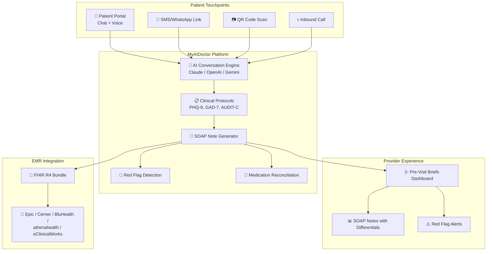
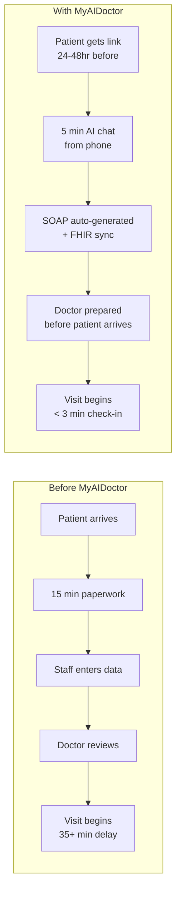
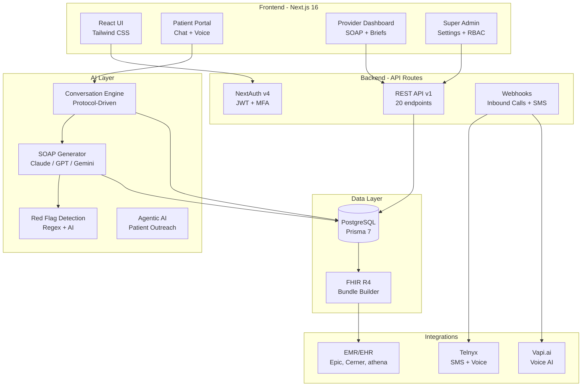

# MyAIDoctor.io — Demo Script & Walkthrough Guide

> **Confidential — Internal Use Only**
> Version 1.0 | May 2026

---

## Executive Summary

MyAIDoctor.io is an AI-powered clinical platform that automates the pre-visit intake process, reducing patient check-in time from 15–25 minutes to under 3 minutes. The platform uses conversational AI to collect patient health information before appointments, generates SOAP notes for providers, and syncs with EMR/EHR systems via FHIR R4 — eliminating manual paperwork and freeing clinical staff for patient care.

---

## Login Credentials

| Role | Email | Password | What They See |
|------|-------|----------|---------------|
| **Super Admin** | `superadmin@myaidoctor.io` | `MyAIDoc2024!` | Full platform control + all settings |
| **Admin** | `admin@myaidoctor.io` | `MyAIDoc2024!` | User management + platform settings |
| **Dr. Sarah Chen** | `dr.chen@myaidoctor.io` | `MyAIDoc2024!` | Provider dashboard + 2 of Jane's appointments |
| **Dr. Raj Patel** | `dr.patel@myaidoctor.io` | `MyAIDoc2024!` | Provider dashboard + 1 of Jane's appointments |
| **Dr. Amara Okonkwo** | `dr.okonkwo@myaidoctor.io` | `MyAIDoc2024!` | Provider dashboard |
| **Dr. Martinez** | `dr.martinez@myaidoctor.io` | `MyAIDoc2024!` | Provider dashboard |
| **Patient (Jane Smith)** | `jane.smith@email.com` | `MyAIDoc2024!` | Patient portal + 3 upcoming appointments |

### Jane Smith's Appointments

| # | Visit Type | Provider | When | Purpose |
|---|-----------|----------|------|---------|
| 1 | Follow-Up | Dr. Sarah Chen | 2 days from now | Diabetes + HTN follow-up |
| 2 | Annual Wellness | Dr. Sarah Chen | 14 days from now | Annual exam + lab review |
| 3 | Follow-Up | Dr. Raj Patel | 30 days from now | Medication adjustment |

---

## Platform Architecture

---

## Demo Flow (30 Minutes)

### Act 1: The Problem (3 minutes)

**Talking Points:**

Every day, clinics face the same bottleneck: patients arrive, fill out paper forms or type into a tablet in the waiting room, and staff manually enter this into the EMR. This process takes 15–25 minutes per patient, creates data entry errors, and delays the provider from starting the visit.

What if patients could complete their intake before they even arrive — through a simple conversation on their phone?

---

### Act 2: The Patient Experience (10 minutes)

#### Step 1: Login as Jane Smith

1. Open the application
2. Login with `jane.smith@email.com` / `MyAIDoc2024!`
3. You land on the **Patient Portal**

**Say:** "This is what Jane sees when she logs in. She has 3 upcoming appointments — notice the sort toggle to arrange by soonest or latest. Each appointment shows the provider, date, and visit type."

#### Step 2: Start Pre-Visit Intake

1. Click **"Start Intake"** on the first appointment (Dr. Chen — Diabetes follow-up)
2. Choose **Chat** mode
3. The AI assistant begins the conversation

**Say:** "Jane can complete her intake right from her phone. The AI walks her through the clinical intake — asking about her chief complaint, symptoms, medications, allergies, and even administers validated screening tools like PHQ-2 for depression and GAD-2 for anxiety."

#### Step 3: Show Voice Features

1. Point out the **speaker toggle** (🔇) in the chat header — click to enable
2. The bot now speaks each message aloud
3. Point out the **microphone button** — Jane can speak her answers instead of typing
4. Toggle voice gender (♀/♂)

**Say:** "For patients who prefer not to type, or those with visual impairments, the system can speak the questions and listen to spoken answers — completely hands-free."

#### Step 4: Complete the Intake

1. Answer the questions naturally
2. Watch the AI adapt — if Jane mentions chest pain, it asks follow-up questions
3. When complete, the system generates a SOAP note
4. Jane sees a confirmation: "Intake Complete"

**Say:** "In under 5 minutes, Jane has completed what would normally take 15–20 minutes in the waiting room. And the data is structured, coded, and ready for her doctor."

#### Step 5: View Completed Intake

1. Back on the portal, the appointment now shows **"Intake Complete"** (green badge)
2. Click **"View Answers"**
3. Show: Chief Complaint, Clinical Summary, SOAP Note (patient-friendly), Conversation History

**Say:** "Jane can review everything she shared. This is transparency — patients can see exactly what their doctor will receive."

---

### Act 3: The Provider Experience (8 minutes)

#### Step 6: Login as Dr. Chen

1. Logout as Jane
2. Login with `dr.chen@myaidoctor.io` / `MyAIDoc2024!`
3. Navigate to **Pre-Visit Briefs**

**Say:** "Now let's see what Dr. Chen sees. She only sees briefs for HER patients — role-based access control."

#### Step 7: Review Jane's SOAP Note

1. Jane's completed intake appears with:
   - Patient name, visit type badge, chief complaint
   - Appointment date and time
   - Risk score, red flag indicators
2. Click to expand
3. Show the **SOAP Note** tab: Subjective, Objective, Assessment, Plan
4. Show **Differentials** — AI-suggested differential diagnoses
5. Show **Red Flags** — anything requiring immediate attention
6. Show **Transcript** tab — the full patient conversation
7. Show **FHIR R4** tab — the structured data bundle
8. Click **"Export FHIR"** to download

**Say:** "Dr. Chen now has a complete clinical picture BEFORE Jane walks in. The SOAP note includes differentials, red flags, and is structured in FHIR R4 — ready to push directly to the EMR."

#### Step 8: Show Provider Filtering

1. Logout as Dr. Chen
2. Login as `dr.patel@myaidoctor.io` / `MyAIDoc2024!`
3. Go to Pre-Visit Briefs — **empty** (Jane hasn't completed intake for Dr. Patel's appointment yet)

**Say:** "Dr. Patel only sees his own patients. Once Jane completes the intake for his appointment, it will appear here automatically."

---

### Act 4: The Admin Experience (7 minutes)

#### Step 9: Login as Super Admin

1. Login with `superadmin@myaidoctor.io` / `MyAIDoc2024!`

#### Step 10: Patient Management

1. Navigate to **Patients**
2. Show the patient list with search
3. Click **"+ Add Patient"** — show quick add form
4. Click **"EMR Search"** — search "Robert" in BluHealth
5. Show **Import** from external EMR
6. Expand a patient → show **Schedule Appointment** and **Push to EMR**

**Say:** "Staff can add patients, import from connected EMR systems, and push data back — full bi-directional sync."

#### Step 11: Patient Messaging

1. Navigate to **Send Patient Link**
2. Search for a patient
3. Add multiple services to the queue (e.g., Appointment Reminder → Pre-Visit Intake → Medication Refill)
4. Reorder with arrows, set delays between messages
5. Show the channel selection (SMS / WhatsApp / iMessage)

**Say:** "Staff can send targeted service links to patients in sequence. Each message waits for the previous one to be completed before sending the next."

#### Step 12: Agentic AI

1. Navigate to **Super Admin → Agentic AI**
2. Click **"Run Analysis"**
3. Show recommendations per patient
4. Show the QR Codes tab — printable codes for waiting rooms

**Say:** "The Agentic AI autonomously scans all patients, identifies who needs outreach, and recommends which services to send — appointment reminders, chronic disease check-ins, medication refills. And these QR codes can be displayed in your waiting room for walk-in patients."

#### Step 13: Settings Overview

1. Navigate to **Settings** in sidebar — expand the menu
2. Click through tabs: **Platform**, **AI Services**, **EMR / FHIR / HL7**, **HIPAA**, **Clinical Protocols**, **Patient Services**
3. Show the 15 clinical protocols
4. Show HIPAA compliance settings

**Say:** "Everything is configurable — AI providers, EMR connections, HIPAA compliance settings, clinical protocols, and custom patient services."

---

### Act 5: The Value Proposition (2 minutes)

**Key Metrics to Highlight:**

| Metric | Before | After | Impact |
|--------|--------|-------|--------|
| Patient check-in time | 15–25 min | < 3 min | **85% reduction** |
| Staff data entry | 10–15 min/patient | 0 min | **100% eliminated** |
| Provider prep time | 5–10 min chart review | 2 min brief review | **70% faster** |
| Patients seen per day | 20–25 | 28–35 | **30% increase** |
| Patient no-show rate | 15–20% | 8–12% | **40% reduction** |
| Documentation completeness | 60–70% | 95%+ | **Near-complete** |

---

## Handling Common Questions

**Q: "Is this HIPAA compliant?"**
A: Yes. All data is encrypted in transit (TLS 1.2+) and at rest (AES-256). We support BAAs with all third-party vendors. HIPAA compliance settings are configurable in the platform — audit logging, access controls, session timeouts, and breach notification workflows are all built in.

**Q: "Does it work with our EMR?"**
A: We support Epic, Cerner/Oracle, athenahealth, eClinicalWorks, BluHealth, and any custom FHIR R4 compliant system. Data syncs bi-directionally with conflict resolution.

**Q: "What if a patient reports an emergency?"**
A: The system has real-time red flag detection. If a patient reports chest pain with shortness of breath, stroke symptoms, or suicidal ideation, the AI immediately stops data collection, flags the response, alerts the provider, and directs the patient to call 911.

**Q: "What about patients who aren't tech-savvy?"**
A: Multiple access methods: SMS text link (just tap and chat), QR code scan in the waiting room, phone call with AI voice assistant, or traditional web portal. The chat uses simple language and the bot can speak questions aloud.

**Q: "How long does implementation take?"**
A: The platform can be configured and connected to your EMR in 2–4 weeks. No hardware required — it's fully cloud-based.

---

## System Architecture

---

## Clinical Protocols Active (15)

| # | Protocol | Category | Use Case |
|---|----------|----------|----------|
| 1 | Schmitt-Thompson Diabetes | Endocrine | Glucose monitoring, A1C, complications |
| 2 | Schmitt-Thompson HTN | Cardiovascular | BP monitoring, DASH diet, medications |
| 3 | Schmitt-Thompson Chest Pain | Cardiac | Risk stratification, ECG triggers |
| 4 | Heart Failure Protocol | Cardiac | Daily weights, orthopnea, edema |
| 5 | NAEPP Asthma/COPD | Respiratory | ACT score, rescue inhaler use |
| 6 | Shortness of Breath | Resp/Cardiac | Dyspnea differentiation |
| 7 | Fatigue Protocol | General | Thyroid, anemia, depression screen |
| 8 | PHQ-9 Depression | Mental Health | 9-item validated depression scale |
| 9 | GAD-7 Anxiety | Mental Health | 7-item validated anxiety scale |
| 10 | AUDIT-C Alcohol | Substance Use | 3-item alcohol screening |
| 11 | Medication Reconciliation | Medications | Full med list verification |
| 12 | USPSTF Preventive | Preventive | Age-based screening gaps |
| 13 | CDC STEADI Fall Risk | Geriatric | 3-question fall screen (65+) |
| 14 | Red Flag Escalation | Emergency | Immediate transfer triggers |
| 15 | SDOH Screening | Social | Food, transport, housing, safety |

---

## API Endpoints (20)

| Method | Endpoint | Direction | Purpose |
|--------|----------|-----------|---------|
| GET | `/api/v1/patients` | Outbound | List/search patients |
| POST | `/api/v1/patients` | Inbound | Create from EMR |
| GET | `/api/v1/appointments` | Outbound | List with filters |
| POST | `/api/v1/appointments` | Inbound | Create from scheduler |
| GET | `/api/v1/intake/{id}` | Outbound | SOAP + transcript + FHIR |
| POST | `/api/v1/intake/{id}` | Inbound | Submit intake data |
| GET | `/api/v1/intake/{id}/fhir` | Outbound | Pure FHIR R4 bundle |
| POST | `/api/v1/messaging/send` | Outbound | Send patient link |
| POST | `/api/v1/voice/call` | Outbound | Trigger AI voice call |
| GET | `/api/v1/openapi.json` | Outbound | OpenAPI 3.0 spec |

---

## Cost Estimates

| Service | Provider | Cost | Monthly (100 patients/day) |
|---------|----------|------|---------------------------|
| SMS | Telnyx | $0.004/msg | $12 |
| Voice (inbound) | Telnyx | $0.005/min | $15 |
| AI Voice | Vapi.ai | $0.05/min | $300 |
| AI Chat | Anthropic Claude | ~$0.03/intake | $72 |
| Phone Number | Telnyx | $1/month | $1 |
| **Total** | | | **~$400/month** |

> Without AI voice calls (chat-only): **~$100/month**

---

*Document prepared for MyAIDoctor.io — Confidential*
*Last updated: May 2026*
